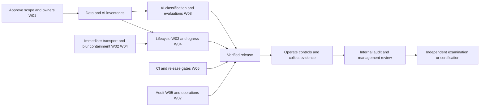

# Integrated remediation roadmap

**Status:** Proposed 2026-09-04; technical checkpoints for W02.1, W04.1, W04.2 and W05.1–W05.5 are in progress as of 2026-09-10. No framework readiness, operating effectiveness or certification is asserted.
**Status:** Proposed 2026-09-04; technical checkpoints for W02.1, W02.4, W03.1, W03.2, W03.4, W04.1, W04.2, W05.1, W05.5, W08.1, W08.2, W08.3 and W08.5 are in progress as of 2026-09-10. No framework readiness, operating effectiveness or certification is asserted.
**Status:** Proposed 2026-09-04; technical checkpoints for W02.1, W02.4, W03.1, W03.2, W03.4, W04.1, W04.2, W05.1 and W05.5 are in progress as of 2026-09-10. No framework readiness, operating effectiveness or certification is asserted.
**Status:** Proposed 2026-09-04; technical checkpoints for W02.1, W04.1, W04.2, W05.1 and W05.5 are in progress as of 2026-09-10. No framework readiness, operating effectiveness or certification is asserted.
**Baseline:** [23 findings](EQ-compliance-assessment.md).
**Scheduling convention:** Day 0 is sponsor approval and allocation of owners/resources, not a legal grace period. Address applicable legal duties and immediate exposure now, regardless of the planning horizon.

## 1. Accountability and sequencing

One executive sponsor should accept the scope and fund the work. Assign a named accountable person to each role below; an individual can hold several roles in a small organization, but must not independently audit their own implementation. Use an external reviewer where separation is otherwise impossible.

| Workstream | Accountable role | Responsible/supporting roles | Findings | Target window | Planning effort, person-days |
|---|---|---|---|---|---|
| W01 — Scope, risk and management systems | Executive sponsor | Security, privacy/legal, AI/product leads | F08/F10/F16/F19/F20 | Start now; baseline by day 30 | 10–20 |
| W02 — Network boundaries | Security lead | iOS/network engineer, independent tester | F01/F02 | Containment days 0–7; hardening by day 30 | 12–25 |
| W03 — Data lifecycle | iOS lead | Privacy lead, storage engineer, QA | F04/F05/F06 | Design by day 14; delivery days 15–60 | 15–30 |
| W04 — Consent, egress and tool authority | Privacy lead | iOS/security/product leads | F03/F08/F09/F10/F11/F19 | F03/F09 containment days 0–7; policy by day 45 | 15–30 |
| W05 — Audit evidence | Security lead | iOS/service engineer, privacy lead | F07 | Correctness by day 14; integrity by day 45 | 6–12 |
| W06 — Build and release assurance | Engineering lead | Release engineer, security reviewer | F13/F14/F15 | Baseline by day 30; sustained operation | 8–18 |
| W07 — Access, people and operations | Operations lead | Security, HR, service owners | F12/F17/F18 | Baseline by day 45; exercises by day 75 | 12–25 |
| W08 — AI governance and assurance | AI/product lead | Domain experts, privacy/legal, security, QA | F08/F11/F20/F21/F22/F23 | EU/use restrictions now; gates by day 60 | 18–35 |

Effort ranges are initial estimates, overlap across shared work and exclude external audit fees, legal review, supplier response time and a SOC 2 observation period. Re-estimate after inventory and implementation spikes. Certification dates cannot be derived from these estimates.

## 2. W01 — Establish one accountable compliance program

**Outputs:** signed scope, service/AI/data inventories, risk register, control register/SoA, policies, commitments, supplier register and evidence index. Reuse existing organization records after evaluating their scope and currency.

| Task | Action | Acceptance and evidence |
|---|---|---|
| W01.1 | Name legal entity, products/build variants, staff, locations, services and intended users. Identify EU offerings/deployments and actual customer commitments. Distinguish personal developer use, managed business use and operator-hosted services. | Signed boundary diagram and service description cover every deployed component or give a defensible exclusion; unknown ownership/regions have owners and deadlines. |
| W01.2 | Adopt risk criteria and a repeatable process for security, privacy harms and AI impacts. Seed with F01–F23. | Every risk has asset/data subject, scenario, likelihood, impact, existing controls, treatment, owner, due date, residual risk and approval. No high residual risk accepted solely by its implementer. |
| W01.3 | Build a control register with framework mappings, scope, owner, frequency, implementation, evidence, tests and exceptions. Draft and approve ISO 27001 SoA; separately maintain PIMS/AIMS applicability. | All ISO 27001 Annex A controls considered; inclusions/exclusions justified by risk/legal/contract needs. Licensed 27701:2025 and 42001 control mapping checked. Clauses 4–10 cannot be dismissed merely because an Annex control is excluded. |
| W01.4 | Approve security, privacy, AI-use, development, supplier, access, incident, retention and continuity policy set. Include legal/register change review and climate relevance in organizational context. | Policies have owners, version, approval, review cycle, affected staff, training/acknowledgment and operational procedures. Climate relevance decision documents actual site/supplier/availability context. |
| W01.5 | Inventory all public claims: privacy/local-only/medical/legal/AI expertise and availability. Reconcile with code, configuration and contracts. | Each claim cites supported configuration and evidence; inaccurate claims corrected in the implementation phase. ISO/SOC logos or claims require an actual scoped report/certificate and permitted use. |
| W01.6 | Evaluate suppliers and shared responsibilities. Obtain applicable security reports, contractual duties, region/retention/training settings and rights/incident support. | Every restricted-data recipient has an approved profile or is blocked for that data class. Distinguish BYOK user-chosen independent recipients from operator subprocessors. |

**Dependencies:** start immediately; W03/W04/W08 need inventory fields, but do not wait to contain verified technical defects. **Cadence:** initial weekly risk meeting; quarterly and material-change review thereafter (proposed policy).

## 3. W02 — Secure every network boundary

Reuse [DO](DO-local-network-transport-hardening.md) and [DN](DN-outbound-fetch-and-sideload-hardening.md), confirming remaining work from code rather than old plan status.

| Task | Action | Acceptance and evidence |
|---|---|---|
| W02.1 — 🟡 Release containment, listener-composition proof and artefact check implemented 2026-09-10; signed-device inspection pending | `LocalServiceExposurePolicy` refuses the MCP Glasses and Web HUD cleartext listeners in Release before token or listener creation, clears their persisted opt-ins and suppresses the HUD registration URL. Both servers now take an injected policy and an injectable `LocalListenerFactory` in place of an inline `NWListener`, publish an explicit `LocalServiceAvailability.unavailableInProduction` state, and retire the stale developer opt-in through injected defaults at the point of refusal. `LocalListenerProvider.production` compiles the socket-opening branch into Debug only, so a Release binary has no listener code left to call and carries a refusal marker instead of a transport marker. Debug keeps the intended phone-to-Mac LAN workflow; restrict it to internal builds and use loopback for developer paths that do not require a second device. | Both real servers were composed over a Release-flavoured policy and a recording listener factory: the factory was never invoked, availability was the production-unavailable state, both persisted opt-ins were cleared and the HUD registration URL was nil; the Debug cases invoked the factory exactly once with the expected service and port, and the medical hard-disable still short-circuits ahead of it. `LocalServiceExposureCompositionTests` (7) and `LocalServiceExposurePolicyTests` (5) passed alongside `WebHUDMirrorTests` (14) in a 103-test focused run with 0 failures, and the full `OpenGlassesTests` suite executed 4,893 tests with 13 skipped and 0 failures on Xcode 27 (build `27A5228h`) against the iOS 27 simulator. `Scripts/check-release-listener-strings.sh` inspects a built artefact for the two Debug-only listener markers and the Debug-only `internalSkillPack` profile literal, using the Release refusal marker and the public `qrContext` profile as positive controls so an empty result cannot pass silently; it passed against the unsigned arm64 Release simulator app built in this worktree (Xcode build `27A5228h`, x86_64/arm64, SHA-256 `3cb8e36a9b1a8a2001b893a230eec31adc7869d5f48a4eb250de68f061cbf0a5`). Still required: inspect a signed artefact installed on a device and observe its network behaviour; W02.2 still owes authenticated encrypted pairing, token/URL removal, expiry, revocation, limits and scoped capabilities, and Debug LAN remains an explicit insecure development exception until it lands. |
| W02.2 | Design encrypted peer authentication/pairing for native MCP and an HTTPS/WebRTC browser sharing route. Remove bearer/query token URLs. Add session expiry, revocation, request/connection/rate limits and scoped camera/display/TTS capabilities. | Packet capture with synthetic data shows no reusable credentials/content in plaintext; wrong/expired/revoked peer rejected; lock/background/stop behavior matches approved policy. Test listener composition, not only a helper. |
| W02.3 — 🟡 Single endpoint rule implemented 2026-09-10 | `EndpointPolicy.validate(url:for:)` is now the one endpoint decision for every client. It rejects any scheme outside http/https/ws/wss, refuses a URL carrying userinfo credentials before it looks at the host, and refuses cleartext http/ws in Release. The private-network exception is keyed on the route's registry entry rather than on the address, so only `localNetwork`, `loopback` and `gateway` routes may address loopback or RFC1918 space, and a cleartext exception additionally requires the destination itself to be private — a local-network route pointed at a public host gets nothing. Applied at MCP HTTP transport, the custom agent harness, the Hermes bridge, the OpenClaw gateway socket/bridge/event stream and its connection test, FHIR export and its connection test, the provider model catalogs, the on-device model repository client and background transfer, the HuggingFace voice and ASR and fingerspelling installers, the skill-pack and vault-pack catalogs, the localization download, the playbook HTTP step, the expert webhook and signaling client, the offline sync sink, browser streaming, broadcast chat and the three OAuth token exchanges. The gateway's LAN mode is a documented exception with its reason recorded in code: gateway configs carry a `lanURL` and a self-hosted gateway is the ordinary case. | `EndpointPolicyTests` covers each rejection class — scheme, unparseable/hostless, userinfo credentials for every route, private host from a cloud route, cleartext to a public host in Release, and websocket spellings — plus the load-bearing negative: a local exception granted to the MCP transport does not authorize web search, inference, the voice vendor, FHIR or a model download at the same address. 14 tests passed. Still required: a signed Release artifact inspection and device packet capture showing no cleartext or credential-bearing destination in practice; DNS-rebinding is out of scope here and stays with `BoundedHTTPClient`. |
| W02.4 — 🟡 Bounded fetch, consent, staging and streaming archive checkpoint implemented 2026-09-06; transport deadlines, connection-plan hostname retention and manifest-first extraction implemented 2026-09-10 | QR context, signed catalog/archive and public skill-pack downloads now use named `BoundedHTTPClient` profiles. Each hop resolves once, refuses mixed/private/reserved public answers, pins an approved numeric peer while retaining the TLS hostname, manually revalidates at most three redirects, rejects downgrade/loops and enforces MIME/content/transfer coding and streamed byte caps. Private HTTP pack loading exists only in Debug, permits only private addresses and refuses redirects. Sideload approval remains exact-request-bound, single-use and five-minute limited before 32 KiB streaming into protected/no-backup staging; the second single-use review and install hash/re-extraction bind installation to inspected bytes. The ZIP reader maps capped input, validates central/local/descriptors/physical ranges and streams stored/deflated output in 32 KiB chunks with actual limits and incremental CRC; skill-pack policy rejects unsafe paths, ratios, aggregate size, nesting and Unix special-file/type masquerading. Since 2026-09-10 each profile also carries a first-byte and an idle deadline inside that total bound: a peer that accepts the connection and then sends nothing fails as `firstByteTimeout`, one that stalls part-way through the body fails as `idleTimeout`, and only bytes actually delivered move the clock, so headers, a declared length, a redirect or an empty read cannot extend either window. The endpoint/name split is now a `PinnedConnectionPlan` value the transport consumes: the socket goes to the pinned numeric peer while the TLS server name, the `SecPolicyCreateSSL` hostname and the `Host` header all stay the request's own host, on each redirect hop its own. Skill-pack extraction is two-phase — `extractManifest` applies the whole entry policy and inflates only `skillpack.json`, `SkillPackStore.admitManifest` decodes and validates it, and `materializeFiles` inflates payload bytes only afterwards, and only the files a manifest declares when it declares any. | The earlier 13-test containment suite passed. Xcode-beta built and linked the arm64 Debug app and full test bundle containing the 60-test focused network/archive/sideload selection. It also built and inspected the current unsigned arm64 Release simulator artifact (build `27A5228h`, SHA-256 `ec32f1eb275856c43f36e4cf76d116ffa01d3df384f3e5aa4332e299cc84eb1a`); public profile/policy strings were present and the Debug-only `internalSkillPack` literal was absent. Two runtime attempts produced zero XCTest cases: a new simulator timed out booting, and an existing booted simulator stalled in `com.apple.dt.xctest.target-runner` “waiting for workers to materialize.” On 2026-09-10 the focused five-class network/archive/sideload selection executed **72 tests, 0 failures** (60 before this change) and the full `OpenGlassesTests` suite executed **4888 tests, 13 skipped, 0 failures** on a healthy iOS 27 simulator; a `-configuration Release` simulator build of the same tree succeeded with no new warnings in the changed files. The new cases cover both deadlines at their boundaries and that a response cannot extend them, the pinned-peer versus verified-hostname split including the already-numeric host and the post-redirect hop, and that a manifest refused at admission leaves every other entry uninflated (asserted through an inflation counter over a poisoned entry). Still required: inspect a **signed** installed artifact, and collect physical-device DNS, redirect and private-address evidence. |

**Exit gate:** security owner approves threat model and independent network evidence; unresolved transports remain restricted. No requirement for universal certificate pinning is invented—choose platform trust, pairing/pinning or mutual authentication appropriate to the specific boundary.

## 4. W03 — Make retention, deletion and exports consistent

Reuse [DL](DL-medical-secret-and-export-lifecycle.md)'s implemented protected-export approach. Expand the lifecycle to all sensitive stores instead of duplicating isolated medical logic.

| Task | Action | Acceptance and evidence |
|---|---|---|
| W03.1 — 🟡 Executable inventory implemented 2026-09-10; owner sign-off pending | `DataStoreRegistry` records 53 stores, each with data class, subject linkage (wearer / third-party / none), the protection the owner actually applies, actual backup exclusion, retention trigger, owner type and source paths, and separate delete-all and delete-subject availability with a reason wherever there is none. The rendered matrix is generated into [ET](ET-iso27701-privacy.md) §2.1 from the registry, so the document cannot drift. Values are descriptive: `platformDefault` means no attribute is set, and it is recorded rather than smoothed over. | `DataStoreRegistryTests` passed 21 tests. Exhaustiveness is scraped, not asserted by hand: every file that opens SQLite, writes into the app container, encodes structured content into preferences or adds a Keychain item must be a registered owner or one of 13 exempt files, each carrying its reason. Attribute truth is read back off real stores built over a temporary directory (backup exclusion always; file protection where the simulator reports it). Writing the first version and running the test immediately caught two entries naming a delete API that did not exist. Still owed: privacy-owner sign-off on the matrix; a device run confirming the protection values the simulator declines to report; approved retention periods per data class (W03.3). |
| W03.2 — 🟡 Coordinated erasure implemented 2026-09-10; peer acknowledgement pending | `SubjectErasureCoordinator` erases one subject — a person, a thread or a document — across 22 stores in one order, derived indexes before their sources and staged exports before either. Every store returns an `ErasureReceipt` carrying `localComplete`, `remotePending`, a removed count and, where the store cannot be reached by subject, the reason: a recording is not indexed by who is audible in it, a clinical transcript is filed by session, a diarization label is keyed by voice cluster. `remotePending` is only true where a deletion request was actually queued. The missing deletes were added: `EvolvedSkillStore`, `VaultDocumentLedger`, `RecordedSessionStore.deleteAll`, `FaceRecognitionService.forgetAllFaces` and agent-document line removal. | `SubjectErasureTests` passed 12 tests. The canary seeds one synthetic person into thirteen stores, erases, reopens every disk-backed store from its files and looks again through each store's own read and search API, through prompt assembly, and at an archive staged before the erasure. Tombstone survival and a post-restart retry are covered; the tombstone names the subject deliberately and is the only place the name may remain. It caught a real defect on first run — `ContextualNoteStore.deleteMatching` lowercased the note but not the query. Still owed: a peer that acknowledges the queued deletion rather than merely accepting it, so `remotePending` can become confirmed; hold semantics, deliberately absent because no hold mechanism exists; W03.3 retention for the stores erasure cannot key by subject. |
| W03.3 | Add explicit approved retention by data class and deploy durable purge jobs. Purge expired rows as well as hiding them. Handle migration backups and abandoned temporary files. | Time-controlled tests cover expiry boundaries, disabled mode, interrupted cleanup, locked protected data, long offline periods and stale `.migrated` files. Cleanup receipts report counts/failures without recording deleted PII. |
| W03.4 — 🟡 Protected staging implemented 2026-09-10; device share evidence pending | The agent archive, the HECA safety PDF and the Field Assist session record now go through `ProtectedExportFileStore` via a shared `StagedExportCoordinator`, joining the clinical and diagnostics families on the same mechanism rather than a fourth copy of it. The archive's readable tree is staged *inside* the already-protected session directory, so the plaintext intermediate the previous implementation left in the shared temporary directory no longer exists at any point. Field Assist artifacts are derived — `session.json` and `log.jsonl` remain and rebuild them on demand — so binding the shareable copy to a lease costs the engineer nothing, and its queued audit op now records formats rather than paths. Launch scavenge and backgrounding release are wired into the app lifecycle. | 19 new staged-export lifecycle tests passed alongside 51 in the existing export suites: protect-before-write ordering, backup exclusion read back off the file, directory/file attribute failure and write failure each removing the whole session, staged plaintext not surviving a mid-write failure, all three share outcomes releasing, crash-abandoned sessions swept only past TTL, and revoke-all. `MedicalSecretLifecycleTests` still passes unchanged. Still owed: a physical-device share lifecycle, including a share extension holding a file across backgrounding, and a HECA share surface — the safety tool currently stages a PDF with no UI to hand it to. |
| W03.5 | Decide backup/recovery and erasure semantics together. Avoid claims that overwriting a file guarantees removal from flash snapshots. | Document logical deletion, cryptographic erasure where keys are scoped appropriately, backup expiry and post-restore deletion replay. An encrypted restore drill respects previously completed erasures. |

The W03.1/W03.2/W03.4 work was verified together on the iOS 27 simulator with Xcode 27: the full `OpenGlassesTests` target ran **4,928 tests, 13 skipped, 0 failures**, and an unsigned arm64 Release simulator build succeeded. No physical-device exercise was performed.

**Exit gate:** privacy owner signs a data-lifecycle matrix; testing covers a connected store graph, not merely independent delete methods. Lawful retention/holds must be reasoned exceptions, access-restricted and communicated accurately; do not promise unconditional deletion of recipient-controlled copies.

## 5. W04 — Enforce purpose, destination and action authority

| Task | Action | Acceptance and evidence |
|---|---|---|
| W04.1 — 🟡 Fail-closed frame checkpoint extended 2026-09-10 | Retains the 2026-09-06 checkpoint (verified no-face separated from detector failure; opaque still replacement; relay drops on suspension, conversion, detection or compositor failure with a publication recheck) and adds four things. A consumer roster (`OutboundFrameConsumer`) maps every camera-frame consumer to its filter scope and protecting mechanism, and a source scrape fails the build when a frame subscription or `filtered(_:for:)` call belongs to a type not on it, or when a type outside a short justified list reads the raw camera tap. Tool-started (voice) video recording, which still subscribed to the raw camera publisher after the app-side button moved to the shared blur relay, now records from the relay and refuses to record without it. Filter availability is no longer a single explicit suspend: `PrivacyFilterAvailability` takes injectable scene-phase and device-lock signals, treats the `.inactive` transition window as unavailable, and invalidates cached face rectangles when availability returns, so publication resumes only after a fresh detection. `FaceRectCache.masking` replaces "empty rectangle list" with rects / verified-clear / stale, and `maxDetectionAge` (0.6 s, three detection intervals) caps the age of a detection that may back a published frame — re-tested at the publication boundary, so a mask that goes obsolete during a slow detection or composite drops the frame instead of releasing it. | Full `OpenGlassesTests`: 4909 executed, 13 skipped, 0 failures; `-configuration Release` build succeeded (Xcode 27 beta, iOS 27 simulator). New: 8 `OutboundFrameConsumerTests`, 13 `PrivacyFilterAvailabilityTests`, 12 `OutboundFrameStalenessTests`; the existing 27 `OutboundFramePrivacyTests`, 4 `PrivacyFilterScopeTests` and 5 `AssessmentPrivacyTests` still pass. Closes: consumer exhaustiveness for the frame-subscription and chokepoint surface, the tool-recording bypass, headless foreground/background/lock and transition-window evidence, and the between-intervals decision. Still required: device captures of real foreground/background/lock transitions, and of the blur under real CPU/thermal pressure — the slow-detector test proves the drop policy, not throughput. Newly identified and still open: about twenty-two still-image call sites read `CameraService.latestFrame` directly (structured vision, safety assessment, teleprompter, study, live coach, assistive/navigation, and the identification, lookup, scanning and capture tools) without passing through `filtered(_:for:)`, so the roster does not yet enforce them; and the crop dwell capture writes to the Photos library is an unresolved egress decision. Privacy-off behavior remains an explicit user choice. |
| W04.2 — 🟡 Universal egress guard implemented 2026-09-10 (LLM boundary 2026-09-06) | `NetworkRouteRegistry` now names all 50 outbound routes with the purpose, data classes, endpoint class and medical policy of each, and `MedicalEgressGuard` turns the medical mode plus the local-only flag into an allow/refuse with a typed reason. It agrees with `MedicalLLMRoutingPolicy` by construction on when the mode binds, and inference now asks it rather than re-deriving the answer. Guards sit at the request-construction point of every blocked route: live and batch diarization, ElevenLabs synthesis and its voice catalog, both realtime sessions, cloud translation captions, intent classification, the provider model catalogs, web search, weather, news, currency, aircraft, AED lookup, Home Assistant and its entity cache, gateway skills, the gateway socket/bridge/event stream, the Hermes bridge, MCP HTTP transport, the custom agent harness, the expert webhook and signaling, the offline sync sink, browser streaming, broadcast chat, the catalogs, the localization download, the OAuth token exchanges and the MCP/HUD listeners. Refusals reuse the fallback that already existed rather than inventing UI: the cloud voice drops out of the TTS engine chain so Kokoro or the iOS voice still speaks, web search returns a sentence saying cloud search is unavailable, and a queued work record reports a transient outcome so it stays queued. Five routes are permitted with written justifications — on-device model acquisition and the loopback OAuth listener — and three are recorded as not applicable: the operator's own FHIR system, its connection test, and recall summarization, which owns no transport and delegates to inference that the routing policy already redirects on-device. `MedicalEgressCoordinator` closes live sessions when the mode flips on, consuming `HIPAAComplianceService.onModeChanged` from the composition root without editing that type, and the Local Only switch now posts a change notification it never had. | `NetworkRouteRegistryTests` source-scrapes `OpenGlasses/Sources` for `URLSession`/`webSocketTask`/`NWConnection`/task-factory owners and fails when an owning type maps to neither a route nor one of two justified transport exemptions, so the inventory cannot rot; it also pins which routes escape the rule. `MedicalEgressCanaryTests` drives each guarded service through its real request-construction point with a counting `URLProtocol` underneath, asserting nothing arrived, then turns the mode off and asserts the same drive does arrive. `MedicalEgressCoordinatorTests` drives the teardown with fakes. Focused run: 14 + 8 + 17 + 7 + 14 tests passed. Still required: device packet capture under restricted mode; the guard's own known limit is that a registered `URLProtocol` sees the shared session but not a session a client constructs itself, so those clients are pinned by refusal text rather than by the counter; and precise Apple Health/workout labelling. |
| W04.3 — 🟡 Versioned consent record implemented 2026-09-10 | A consent record now carries purpose, data class, recipient, actor, version, grant time and an optional withdrawal, in a protected, backup-excluded register. A pure policy answers granted / not granted / withdrawn / stale, and the shared remote-action surface consults it under the existing prompt: a source whose consent was withdrawn is refused without asking, and a terms version bump names the change in the ask and re-records the answer. The wearer, the subject and an enterprise authority are separate actors; a subject enrolment needs evidence only a live enterprise authority record can produce, so a wearer's approval cannot be made to stand for a subject's. Nothing converts an OS permission into a record. | The focused consent suite passed within the 67-test W04.3/W04.4 selection, inside a full run of 4,943 tests (13 skipped, 0 failures), with a clean `-configuration Release` build. Still required: the legal determination of which consent purposes this product needs and how each is described; the off-device process that establishes an enterprise authority in the first place, and its revocation path; capture and recipient visibility for audio and HUD use; a wearer-facing screen to read and withdraw records; and applying the register to capture, enrolment and clinical export rather than remote actions alone. |
| W04.4 — 🟡 Bound approvals and effect classes implemented 2026-09-10 | Every call is classified — read, write, messaging, physical actuation, sensitive disclosure, financial, or unknown — and anything a party outside this repository authored is classified from data that party wrote, so it can never be read-only. The floor runs after the existing ladder and can only strengthen it: messaging, actuation, disclosure and unreviewed effects are held whatever agent mode says and whichever path the call arrived on, and every external call above a read is held too. An approval is now a single-use grant bound to the seam, the tool, the definition digest, the canonical argument digest and the approval session, issued where the wearer says yes and spent at dispatch against a binding derived again from the call as it stands; replay, changed arguments, a different tool, a different server, a changed definition, expiry and cross-session use each have their own refusal class, and each reaches the authorization ring. The digest last accepted per server is persisted (protected, backup-excluded), so a server whose definitions move is quarantined until reviewed again, and a quarantined tool's own description is replaced with app-authored text before any prompt is assembled. The outbound egress screen moved ahead of the ladder so nobody is asked to approve a call that was always going to be withheld. | 67 focused tests across the grant binding, the effect classes, the re-review and the consent register, inside a full run of 4,943 tests (13 skipped, 0 failures), plus a clean `-configuration Release` build. Still required: adversarial end-to-end runs against a live hostile MCP server and the gateway route; a wearer-facing re-review action for a quarantined definition; classification of the gateway and user-authored HTTP tools from something better than "unreviewed"; a decision on whether native writes to the wearer's own stores should also be bound; and argument-level rather than call-level scoping for tools whose arguments carry a recipient. |
| W04.5 — 🟡 Claim reconciliation implemented 2026-09-10 | `PrivacyManifestReconciliationTests` parses `PrivacyInfo.xcprivacy` from source and checks it against the route registry in both directions: every data class a route can send has a matching `NSPrivacyCollectedDataType`, and every declaration is justified by a route or by a short written note. The audit that produced the manifest was a photograph; this keeps it current. No declaration had to be added — the existing manifest already covered every class the registry says leaves, which is the finding, not an absence of work. One declaration, Fitness, is carried by a written note because HealthKit figures reach a provider inside inference tool results rather than on a transport of their own. The Settings privacy footer said Bystander Face Blur means no images leave the phone, which contradicted the toggle's own copy two lines above and the feature's actual scope; it now says the detection and blurring happen on the phone and the blurred frame is what a provider, recording, broadcast or expert call receives. | 8 reconciliation tests passed, alongside the 5 existing `PrivacyCanaryTests`. The no-tracking claim, required-reason API codes and per-type Linked/Tracking/purpose flags are asserted rather than assumed. Still required: restricted-mode packet capture on a device to confirm the declared set matches observed traffic; a signed release-artifact check; an Apple-rule analysis of whether the user's own provider key constitutes collection (currently reasoned as not, in code, and worth a reviewer's opinion); and the same treatment for the support/diagnostic export surface. |

**Exit gate:** privacy/security sign off on representative end-to-end routes, not just a regex redactor or preference binding. Enterprise policy cannot be weakened by a lower-trust tool, remote prompt or fallback model.

## 6. W05 — Make audit records useful without collecting excess content

| Task | Action | Acceptance and evidence |
|---|---|---|
| W05.1 — 🟡 Authorized clearing and audit-log durability checkpoint implemented 2026-09-10 | Compliance-mode transitions still use a state-independent append path, and disable is recorded before the normal audit gate closes. Clearing now fails closed: `clearAuditLog(authorization:)` has no default argument and proceeds only on an explicit `.granted` `OwnerAuthorization`; denied, and the case where no decision can be obtained, keep the log and append an `AUDIT_CLEAR_REFUSED` record regardless of the current mode. `OwnerGateAuth.authorize` is the fail-closed companion to the existing Simple Mode prompt, which keeps its fail-open default (F12) untouched. Audit persistence moved behind an `AuditLogStore` seam; the production `FileAuditLogStore` is the same protected JSON file written atomically (write-temp-then-rename), a refused write is reported through `lastPersistenceFailure` and rolls the in-memory entry back instead of showing an unpersisted record as recorded, and bytes that will not decode are quarantined rather than overwritten by the next append. | `AuditLogIntegrityTests` (10) and `MedicalComplianceTests` (61) passed inside the 103-test focused run and the full suite (4,893 executed, 13 skipped, 0 failures). Covered: granted clearing records `AUDIT_LOG_CLEARED`; denied and no-decision clearing keep the history, record the refusal and the refusal survives a restart; a log appended, torn down and reloaded over the same store continues rather than restarts; a store that refuses the write leaves the previously persisted bytes identical and reports the failure to the caller; a torn write is never reloaded as a complete log; and the real `FileAuditLogStore` keeps the previous file byte-identical when the write cannot commit. Still required: no UI affordance clears the log today, so the authorization path has no production call site yet and the owner prompt is unexercised on device; W05.2 event schema, W05.3 tamper/rollback detection and W05.4 review and evidence export remain open, as do retention/export cases and disk-full and crash integration tests. |
| W05.2 — 🟡 Typed audit-event schema implemented 2026-09-10 | Audit records were an `action` string and a `detail` string, so a filename, a clinical value or a credential reached compliance evidence by being passed to `log(action:detail:)`. `AuditEvent` replaces them: a closed `AuditEventKind` vocabulary, an actor class (wearer / owner / system / remotePeer / enterprise), a target class (complianceMode / auditLog / transcript / export / enrolment / remoteAuthorization / consent / toolDefinition / model / policy), a purpose from a closed enum or nil, `AuditPolicyVersion.current`, a result (succeeded / refused / failed), an event id, a millisecond-truncated time, and a correlation value that is stored only as a fingerprint. Subject values (an export's bytes, a purged filename) are digests; counts are magnitudes. Pre-schema rows migrate through `AuditEvent.legacy(action:detail:)`, keeping the action token if it is one and the detail only as a fingerprint. Emitted from this branch: compliance-mode enable/disable, audit clear granted/refused (carrying the owner-authorization outcome as a fixed `decision` token rather than a second row), audit export created/released, retention purge completed (count only), file purged and secure delete (filename fingerprinted), integrity check, and policy-version change. Callers that still pass an action and a detail go through a bridge that maps the token into the vocabulary and fingerprints the rest. | `AuditEventSchemaTests` (13), `AuditExportProtectionTests` (7), `AuditLogIntegrityTests` (10) and `MedicalComplianceTests` (61) passed in a 109-test focused run; `PrivacyCanaryTests` (5) and `PrivacyLogTests` (45) passed in a 68-test run with a new probe that drives the audit trail with a canary in every slot a caller can still reach and asserts none survives construction, the event sink or the export. Full suite: 4,944 executed, 13 skipped, 0 failures. Still owed: the events whose sources live in other change sets — deletion completion, consent changes, tool-definition changes and model/tool changes are declared in the vocabulary but cannot be wired from here; migrating the remaining `log(action:detail:)` call sites (the clinical export lease coordinator, the video recording service, launch) to the typed API, which would also recover the counts the bridge drops; and a UI that reads the typed fields as more than a summary line. |
| W05.3 — 🟡 Chain and rollback detection implemented 2026-09-10 | Each stored record carries a monotonic `sequence`, the `prevDigest` of the record before it and its own digest, so altering, deleting from the middle or reordering breaks a link, and editing the last record disagrees with its own written digest. `AuditChain.verify(events:checkpoint:)` returns intact / broken(at:) / truncated(expectedCount:) / rolledBack. A sealed checkpoint — sequence, head digest, time, HMAC over the three under a device-local key — is written to the keychain (this device only, `whenUnlockedThisDeviceOnly`, never synced, so a restored backup cannot carry an old one forward) every sixteen records and on a clear, through an `AuditCheckpointStore` seam. That is what catches a log replaced wholesale by an older but internally valid copy of itself, and a log deleted outright. Verification runs on load; the verdict is recorded as an `integrityCheck` event appended **after** the records it judges, so the chain being judged is not altered, and the damaged records are kept exactly as found rather than repaired. An intact verdict is exposed through `lastIntegrityVerdict` but not written, so an "all fine" row on every launch cannot fill a bounded log and push out what it protects. An authorized clear continues the sequence rather than restarting it, so it is not mistaken for a rollback. The doc comment states plainly that this is tamper-**evident** for a managed deployment's reviewer, not immutable evidence: the chain and its checkpoint both live on the device that wrote them. | `AuditChainIntegrityTests` (18) passed in the 109- and 68-test focused runs and the full suite. Covered: a clean chain; altering a middle record; altering the last record in the stored JSON with its digest left as written; deleting a record from the middle; reordering; deleting the whole log (truncated); rolling back to an earlier valid prefix (rolledBack, and intact without the checkpoint, which is the point); re-linking a tampered prefix so only the checkpoint catches it; no checkpoint on first run; a retention-trimmed suffix still verifying; a checkpoint sealed with another key being rejected; a checkpoint newer than the log; an unavailable checkpoint being reported rather than assumed absent; a pre-schema log migrating without looking tampered; and an authorized clear not reading as a rollback. Still owed: an independently stored checkpoint off-device, which is what would make this survive a motivated local attacker rather than an accidental or casual one; a managed-deployment verification path that runs outside the app; alerting on a non-intact verdict; and an approved rotation/retention policy to measure the 1,000-record ceiling against. |
| W05.4 — 🟡 Protected, retention-bounded evidence export implemented 2026-09-10 (repo part) | `exportAuditLog()` now emits typed JSON — schema id, policy version, export time, entry count, the last verification verdict, the head digest, and every record with its sequence and digests, so a reviewer can re-walk the chain outside the app. `exportProtectedAuditLog()` writes it through `ProtectedExportFileStore.createSession`, so the reviewer's copy is file-protected, excluded from backup, marked complete only once the finished file is protected, and scavenged when its window passes; abandoned sessions are swept before a new export is made. The audit trail records the export by the digest of the bytes written, never their content, and `releaseAuditLogExport` destroys the files and records that too. The audit-log screen shares the protected file rather than a string and releases it on dismiss. | `AuditExportProtectionTests` (7) passed in the 109-test focused run and the full suite: the export lands in a protected session under the export root with its completion marker and backup exclusion; the recorded event carries the digest, the entry count and no detail fingerprint; the exported document contains only schema fields (checked against the bytes a reviewer receives, with a canary planted in every reachable slot); an exported chain re-verifies outside the service; releasing removes the files and records the release; an abandoned export past its window is scavenged by the next one; and a session this process still holds is not. Still owed — all of it outside the repo: a **named reviewer** and an approved **SLA** for acknowledgement and escalation; alerting so a non-intact verdict or a refused clear reaches that reviewer rather than waiting to be noticed; and the end-to-end test the acceptance asks for, one seeded event followed from generation through investigation to closure. |
| W05.5 — 🟡 Journal durability and reconciliation implemented 2026-09-10 (was: fail-closed journal, 2026-09-06) | Operation-journal persistence sits behind an `OperationJournalStorage` seam; production is the same protected Application Support file, written the same way. Writes are all-or-nothing per write and therefore per record: the journal hands its whole row set over in one call and the file store commits it with a write-temp-then-rename, so a failed write leaves the previous journal byte-identical. A file that ends inside a row is no longer read as either whole or empty — `OperationJournalSalvage` recovers the complete records before the break (string-aware, so a brace inside a value does not fool it), the damaged bytes are moved aside under their own name before anything replaces them, and only a file with nothing whole in it makes the journal refuse admission outright. `unresolvedOperations` exposes every operation whose fate is open, and `reconcile(operationID:outcome:at:)` settles one from an answer obtained after the fact, refusing a row that already settled; an operation reconciled after the caller was told the outcome was unknown settles as `late`, not as a second spoken success. | `OperationJournalDurabilityTests` (13) and `OperationJournalTests` (20) passed in a 33-test focused run and the full suite (4,944 executed, 13 skipped, 0 failures). Covered: a full disk leaving the previous journal byte-identical and refusing admission; every later admission staying refused until a fresh journal loads durable state; a locked store never read as an empty history and never quarantined; recovery once protected data becomes available; a kill mid-write keeping the complete records and quarantining the tail; a file with nothing whole preserved rather than salvaged; salvage declining a file that closes properly and not being fooled by a brace inside a string; a torn write never presented as journaled; unresolved operations exposed after a restart as `unknown` and `recoveredFromRestart`; reconciliation settling one late; and reconciliation refused for a settled or unknown operation. Still owed: the recovery **UX** — no screen reads `unresolvedOperations` yet, and no affordance lets a person record what they found; a tool that can actually answer `OperationReconciling` (none does); and on-device evidence, since these are simulator tests against an injected store rather than a real ENOSPC or a real kill. At-most-once guarantees remain limited to the identified delivery and remote idempotency contract. |

**Exit gate:** log correctness, privacy and operational review are all evidenced. Storage of audit evidence follows the legally justified retention schedule; framework names alone do not set a duration.

## 7. W06 — Establish controlled, reproducible releases

| Task | Action | Acceptance and evidence |
|---|---|---|
| W06.1 — 🟡 Action pinning, verified tooling and frozen resolution implemented 2026-09-09 | Pin third-party Actions by reviewed commit, set minimal permissions at workflow/job level, verify XcodeGen downloads, align authoritative manifests/lockfiles and require frozen package resolution. Shipped: all six actions pinned by commit SHA with the tag recorded beside them, `permissions: contents: read` on all four workflows, XcodeGen installed from a single sha256-verified pin (`Scripts/xcodegen-pin.env`) by both pipelines, and GitHub Actions now copies `ci_scripts/Package.resolved` into the generated project and passes `-onlyUsePackageVersionsFromResolvedFile` (checked against `project.base.yml` first — no drift). A `provenance.txt` artifact records toolchain, SDK, lockfile and vendored-binary digests per run. Still owed: an automated check that the two pipelines resolved identically, dependency-update review evidence, and — untouched by this work and still open under W06.2 and W06.4 — the branch-protection settings export and the signed-artifact provenance evidence. Nothing in this row is closed. | Two clean CI paths resolve the approved graph; differences fail a gate. Dependency changes have reviews; tool/download integrity failure blocks execution. Record toolchain, SDK, model and binary digests. |
| W06.2 | Protect branches/releases with independent reviews and required tests/security gates. Add dependency/secret scanning and vulnerability intake/triage with explicit SLAs. | Export actual repository settings, demonstrate an intentionally failing PR cannot merge/release, and record emergency-change retrospective. Tests run on the committed release revision, not an unrelated local build. |
| W06.3 — 🟡 Staged-allowlist publication implemented 2026-09-09 | Restrict Pages to a staged allowlisted website directory; inventory other artifacts/log uploads. Shipped: `Scripts/stage-pages-site.sh` stages fifteen named paths into `_site/` and then runs a denylist over the staged listing independently of the allowlist, so an allowlist mistake fails the deploy rather than publishing; `pages.yml` uploads `_site` instead of the whole checkout. Still owed: the inventory of the other artifact and log uploads (test result bundles, provenance) against a retention and content policy. | Artifact listing contains only approved public site paths; automated gate rejects `docs/plans`, credentials, source/build products and internal evidence unless explicitly approved for publication. No historical secret leak is assumed; run separate authorized history/artifact triage if indicated. |
| W06.4 | Produce release SBOM/dependency and model manifests; verify signed pack keys and provenance. Keep signing secrets out of command-line arguments, source and logs. | Release dossier links source review, workflow, tests, manifests, signer identity, artifact digest and distribution version. Rotation/revocation drill works without exposing keys. |
| W06.5 — 🟡 Named security-regression gate implemented 2026-09-09 | Require targeted security regression and integration verification for W02–W05/W08. Shipped: a named `security-regression` job running sixteen boundary suites (network bounds, pack/book admission, untrusted-network and local-service policy, composed-tool containment, outbound frame privacy and filter scope, medical routing/compliance, operation journal, safety gate, privacy canary/log, telemetry opt-out), triggered when a PR touches the security surface, plus `Scripts/check-privacy-logging.sh` as a blocking step ahead of both macOS jobs. Still owed: the device and network integration half — these are simulator unit suites, and a passing unit suite is explicitly not a substitute for a failing integration boundary. | Device/simulator/network tests cover real entry points, protected-data availability, background states, extensions and external services. No passing-unit-test-only claim substitutes for a failing integration boundary. |

**Exit gate:** release owner can reconstruct exactly what was approved, built, tested and distributed. Existing [DP](DP-release-entitlement-boundary.md) build-boundary work should be verified and reused.

## 8. W07 — Operate access, incident and continuity controls

| Task | Action | Acceptance and evidence |
|---|---|---|
| W07.1 | Inventory GitHub, Apple/Meta developer, cloud, signing, support and evidence-system accounts. Require MFA, least privilege, accountable service identities, reviewed recovery and rapid offboarding. | Current access review shows approver/justification; a synthetic leaver loses access and tokens within the approved SLA. Break-glass use is reviewed. Credentials are rotated only where risk/ownership analysis warrants it. |
| W07.2 | Define supported managed-device posture and owner/admin authentication. Separate app configuration convenience from enterprise enforcement. | Required-auth deployments fail closed when passcode/auth is unavailable; tested recovery flow does not bypass policy. Consumer behavior and limitations are accurately documented. |
| W07.3 | Implement proportionate personnel, remote-work and physical protection controls. | Confidentiality agreements, role training, reporting channel, asset assignment, disk encryption/patch/lock posture, visitor/storage/disposal controls and termination records are available in the private evidence system. |
| W07.4 | Approve incident playbooks for credential compromise, unwanted capture, remote action, supplier breach, privacy-rights failure and unsafe AI output. Determine jurisdiction/role-specific notification decisions. | Tabletop produces timeline, decisions, evidence preservation, contacts, simulated notifications and corrective actions. No real external notification is sent during the exercise. |
| W07.5 | Define service commitments, realistic RTO/RPO and outage behavior. Test protected backup restore, key recovery constraints, build/signing recovery, local-mode availability and provider loss. | Restore succeeds on a clean authorized environment, is timed and integrity-checked, and replays erasure state. User-owned local data/keys and unsupported recovery cases are disclosed accurately. |

**Exit gate:** people, policy and infrastructure evidence complements product safeguards. An offline-capable app is not proof a hosted service or encrypted user data can be recovered.

## 9. W08 — Govern AI purpose, behavior and changes

Detailed implementation packages and legal dependencies are in [05-ai-governance-and-eu-ai-act-plan.md](EV-ai-governance-and-eu-ai-act.md).

| Task | Action | Acceptance and evidence |
|---|---|---|
| W08.1 — 🟡 Executable AI inventory implemented 2026-09-10; classification pending | `AIFeatureRegistry` records 13 AI features, each with the sensitive categories it was screened into (biometric, health, worker safety, external actuation, or an explicit `none`), the preferences switch that disables it, the tools it reaches the model through, the stores it writes into, and what stays on disk when it is switched off. Eleven new per-feature switches were added; speaker identification and remote invocation keep the switches they already had rather than gaining a second. `AIFeatureGate.isEnabled` is consulted at twelve tool entry points. | `AIFeatureRegistryTests` passed 16 tests: every feature described and screened, every sensitive category covered, every claimed tool name resolved against the tool sources themselves, every switch round-tripped, four entry points refusing when switched off, and the retention claims checked against the stores — a feature may only claim "nothing retained" where it writes to no store. Face recognition's claim is exercised end to end: disable, run the named erase hook, reopen the store from disk and confirm the name is absent from the array, the read API and the file's bytes. Writing it caught a registry entry naming a vault delete API that does not exist, and its first form — reading names off a headlessly-built `NativeToolRegistry` — reported four false failures, because those tools are registered conditionally and a registry with no camera service answers to fewer names than the app does; the check now scrapes the tool sources. Still owed: the legal classification itself, which is a determination with a named owner and not a code artifact; router-level enforcement of `AIFeatureGate.disabledToolNames`, which waits on the tool-authority branch that owns `NativeToolRouter`; and per-feature switches surfaced in Settings. |
| W08.2 — 🟡 Uncertainty implemented 2026-09-10; domain-expert wording review pending | Confidence is optional at every level of the assessment model — card, finding and instrument reading — and the hard-coded `1.0` that made the card print "Confidence 100%" on every result is gone from all six sites. What the surfaces show is a band produced only when the evidence supports one: `InputQualityPolicy` judges the frame the app actually sent (sharpness and mean luminance, measured once by `ImageQualityProbe`) together with the partial-view and obstruction flags every schema now asks the model for, and `CertaintyPolicy` combines the model's own number with that verdict and any hedging in its prose into uncertain / likely / confident, or into nothing. A frame that does not support an assessment abstains: the tier becomes "not established", a new rank below `ok` that escalation never selects and any real finding replaces, so abstention cannot mask a hazard. First-aid triage abstains on its own account when responsiveness or breathing was never observable. `AssessmentPresentation` renders the band or its explicit absence, the limitations line and the escalation line once, for the card, the HUD and the voice path alike; the HECA PDF gains the same caveat block, and the score line now says the percentage is a ratio of what was visible in one camera view. | `AssessmentCertaintyTests` passed 27 tests alongside 159 in the existing assessment, export and registry suites (186 in one run, no failures; the whole 4983-test suite passes and the Release build succeeds). They assert the load-bearing property directly — no path through any of the three schemas, the decoder or the qualifier turns an absent confidence into a number or a band — plus the abstention thresholds, the band boundaries and their caps, first-aid abstaining without masking a visible injury, the rendered strings for the present/absent/limited cases, and the PDF text containing the caveat and the escalation. Still owed: a domain expert's review of the safety and first-aid wording and the workflow around it; calibration of the sharpness and luminance thresholds against real glasses frames rather than the reading gate's existing values; and a decision on whether the model's self-reported confidence should be surfaced at all once evaluation data exists (W08.4). |
| W08.3 — 🟡 Provenance and disclosure implemented 2026-09-10; human-review record pending | `AIProvenance` carries the model identifier, whether inference ran on the device or left it, a 16-character digest of the instruction version, the timestamp, an explicit `is_ai_generated` field and the app build. It is attached at four points: the assessment card, the HECA PDF (printed footer plus `kCGPDFContextCreator` / `kCGPDFContextSubject` metadata), the Field Assist session record (an `ai_provenance` JSON field and a PDF provenance section), and a `provenance.json` in the agent archive naming which parts of the archive a model wrote. Where no model is configured the block still says so — `unrecorded` — because an absent block reads as "not AI". `AIDisclosureLedger` speaks the interaction disclosure once per session on the first assessment, through the HUD line and the chat/voice seam. | `AIProvenanceTests` passed 12 tests. The end-to-end cases are built from a prompt and a source document seeded with canary tokens that exist for no other purpose, and assert those tokens appear nowhere in the encoded card, the archive manifest, the audit JSON, or the rendered bytes of either PDF — while the model identifier, the digest and the AI marker all survive. The disclosure is asserted to fire exactly once per session, to resolve through the string catalog, and to name the trained human it does not replace. Still owed: the documented human-review and exception decisions the acceptance criterion also asks for; disclosure surfaces beyond assessments (free-text chat and live sessions each need their own first-time copy); and the medical export, which is deliberately untouched here so its lifecycle tests stay unchanged. |
| W08.4 — 🟡 Versioned corpus and safety gate implemented 2026-09-10; threshold approval, real frames and model-side evaluation pending | A versioned evaluation corpus and a blocking gate now exist where there was neither. `OpenGlassesTests/Fixtures/SafetyEvalCorpus` holds 52 synthetic cases across the four verticals that produce a safety output — HECA safety assessment, first-aid triage, instrument reading and the health-safety advisor — each one a model response fixture plus a statement of what the app then owes the wearer: the tier, whether to abstain, which certainty band it may claim, whether an escalation line reaches them, and what the words say. `SafetyEvalHarness` pushes every case through the real handling path (schema decode, backstop, privacy chokepoint, `InputQualityPolicy`, `CertaintyPolicy`, `AssessmentPresentation`, provenance) and reports four rates per vertical, per risk class and per subgroup: false-negative, overconfidence, abstention-when-required and escalation-present. It produces no combined accuracy number by design. `thresholds.json` sets per-risk-class limits — critical 0% false negatives and 0% overconfidence, high 5%, normal 10% — and `SafetyEvalGateTests` fails, with the Markdown report attached, when critical or high is breached; `.github/workflows/safety-eval.yml` runs only that gate on any pull request touching the handling path, the prompt builders, the corpus or the harness, and `Scripts/safety-eval-report.sh` runs the same selection locally. `PromptVersionRegistryTests` snapshots the instruction digest of every assessment schema into `prompt-digests.json` and fails when one moves without the corpus version moving with it, so a reworded prompt cannot ship against results measured from the previous wording. Writing the corpus found and closed two handling defects: a confidence outside 0–1 was read as high certainty rather than as a malformed field, and an impossible instrument reading (a clinical thermometer at 250 °C) passed every check and was spoken to the wearer — `InstrumentPlausibility` now refuses it and raises the card. A third defect was in the mechanism this row depends on: the provenance digest hashed the reflected description of a JSON schema, and Swift seeds dictionary hashing per process, so it identified the run rather than the prompt version; it now hashes canonical key-sorted JSON. | `SafetyEvalGateTests` passed 8 tests, `SafetyEvalHarnessTests` 9 and `PromptVersionRegistryTests` 4, over 52 cases with 0 failing: 0/23 false negatives and 0/18 overconfident at critical risk, 0/7 and 0/15 at high, 100% escalation present across all 52, and every required abstention delivered. Subgroup coverage is 4 languages (en 48, de 2, ja 1, uk 1), 5 input-quality bands (good 27, blurred 4, dark 4, partial 4, not-applicable 13) and 10 scene types. The gate's own failure path is exercised rather than assumed: `SafetyEvalHarnessTests` feeds the harness deliberately wrong expectations and asserts each metric fires, because every corpus case passes and a metric wired to a constant would otherwise keep the report printing 0.0%. Still owed, and it is most of what this row asks: **the threshold approval itself** — the criterion requires risk-specific thresholds approved by a named owner *before* evaluation, and these are proposed floors, which `thresholds.json` states in a field the suite asserts says "not approved"; **a real-frame corpus** — every input-quality indicator here is a supplied number, and the sharpness and luminance thresholds are still the low-vision reading gate's uncalibrated values; **subgroup breadth** — one to three cases sit behind most subgroup values, so those tables are coverage counts and not statistics, and hedge detection remains English-only, so a model hedging in German or Ukrainian would not have its band capped; **model-side evaluation** — nothing here measures whether a model sees a hazard, and changing provider or model moves no number in this report; **expert labelling and domain review** of the cases; and **the security half** of the row, which this corpus does not touch. |
| W08.5 — 🟡 Per-feature disable implemented 2026-09-10; operational half not started | The rollback half of this row now has a mechanism: every sensitive AI feature has a switch, `AIFeatureGate` reads it at the feature's entry point, and `AIFeatureRegistry` records honestly what each one leaves behind when it is off — including the three cases where the answer is "the record stays, deliberately" (a site assessment, an engineer's session log, a remote-invocation audit trail). The "without retaining excess personal data" clause is tested rather than asserted: face recognition is disabled, its named erase hook is run, and the store is reopened from disk to confirm the biometric is gone from the bytes. | Covered by the 16 `AIFeatureRegistryTests` above. Still owed, and it is most of this row: impact review, role-relevant competence checks and training records, a complaints and harm-monitoring channel, an adverse-event drill reaching an accountable owner, and independent assessment. None of those are code. Also owed on the code side: router-level enforcement so a disabled feature's tools are unreachable even from a path that does not call its `execute`, which waits on the branch that owns `NativeToolRouter`. |

## 10. Milestones and stop conditions

| Milestone | Required outcome | Exit decision |
|---|---|---|
| M0, days 0–7 | Owners assigned; F01/F03/F09 exposure contained; EU sensitive use/claims triage; no confidential evidence added to public repo | Sponsor/security/privacy approve affected-feature restrictions |
| M1, by day 30 | Scope/risk/control inventories, initial supplier/IAM records, network policy, audit correctness, CI/publication gates | Independent design review; unresolved high risks have restrictions and owners |
| M2, days 31–60 | Cross-store deletion/retention, export leases, egress/tool controls, AI classification/transparency/evaluation gates | Representative integrated release passes acceptance; privacy and AI impacts accepted |
| M3, days 61–90 | Restore/incident/rights exercises; access review; internal audit and corrective actions | Management review authorizes readiness assessment; no certificate implied |
| M4, after controls stabilize | Operate and sample controls for agreed period; external assessor review | Auditor/certification body determines examination approach, observation period and findings |

Stop distribution of the affected capability if mandatory privacy protection can silently fail, secrets traverse an unapproved channel, consequential actions evade approved authority, or a restricted intended use lacks the required determination. Do not declare all OpenGlasses functionality blocked by a conditional feature finding.

## 11. Evidence register and measurement

Store evidence in a restricted system; commit only sanitized templates and pointers. A control-evidence record should contain:

`control_id, framework_refs, scope, owner, frequency, population_definition, artifact_uri, artifact_digest, period_start, period_end, collected_at, collector, reviewer, sample_method, result, exception_id, retention_until, access_classification`.

A remediation task should contain:

`task_id, finding_ids, owner, status, due_date, dependencies, acceptance_criteria, implementation_pr, release_digest, test_evidence, residual_risk, independent_reviewer, approval_date`.

Use statuses **proposed → assigned → implementing → evidence ready → independently verified → closed**. Risk acceptance is a separate approved disposition with an expiry/review date, not a hidden closed defect.

| Measure | Proposed target / interpretation |
|---|---|
| Sensitive destinations and stores inventoried | 100% of enabled routes; unknowns block restricted-data approval |
| Mandatory filtered frames emitted raw | Zero in defined failure/background integration tests |
| Erasure coverage | All inventoried stores pass subject-canary test; remote pending/holds visible |
| High-impact action authorization | All entry points pass denial, replay and changed-argument tests |
| Release provenance | Every release has reviewed commit, frozen dependencies and signed artifact evidence |
| Privileged identity review | Every scoped identity reviewed at proposed quarterly cadence and role change |
| Incident/restore exercise | Initial exercise before readiness review; subsequent risk-based schedule |
| AI safety evaluation | Meets use-case-specific approved thresholds; no invented universal accuracy target |

Framework documents and this roadmap are proposals. Creating them is not evidence that a policy was approved, a control operated, a subject request was fulfilled or certification was achieved.
