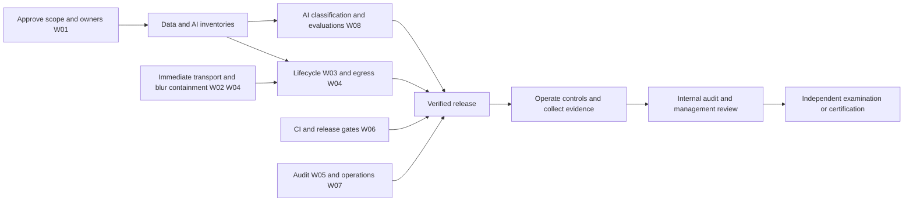

# Integrated remediation roadmap

**Status:** Proposed 2026-09-04; technical checkpoints for W02.1, W04.1, W04.2, W05.1 and W05.5 are in progress as of 2026-09-06. No framework readiness, operating effectiveness or certification is asserted.
**Baseline:** [23 findings](00-compliance-assessment.md).
**Scheduling convention:** Day 0 is sponsor approval and allocation of owners/resources, not a legal grace period. Address applicable legal duties and immediate exposure now, regardless of the planning horizon.

## 1. Accountability and sequencing

One executive sponsor should accept the scope and fund the work. Assign a named accountable person to each role below; an individual can hold several roles in a small organization, but must not independently audit their own implementation. Use an external reviewer where separation is otherwise impossible.

| Workstream | Accountable role | Responsible/supporting roles | Findings | Target window | Planning effort, person-days |
|---|---|---|---|---|---|
| W01 — Scope, risk and management systems | Executive sponsor | Security, privacy/legal, AI/product leads | F08/F10/F16/F19/F20 | Start now; baseline by day 30 | 10–20 |
| W02 — Network boundaries | Security lead | iOS/network engineer, independent tester | F01/F02 | Containment days 0–7; hardening by day 30 | 12–25 |
| W03 — Data lifecycle | iOS lead | Privacy lead, storage engineer, QA | F04/F05/F06 | Design by day 14; delivery days 15–60 | 15–30 |
| W04 — Consent, egress and tool authority | Privacy lead | iOS/security/product leads | F03/F08/F09/F10/F11/F19 | F03/F09 containment days 0–7; policy by day 45 | 15–30 |
| W05 — Audit evidence | Security lead | iOS/service engineer, privacy lead | F07 | Correctness by day 14; integrity by day 45 | 6–12 |
| W06 — Build and release assurance | Engineering lead | Release engineer, security reviewer | F13/F14/F15 | Baseline by day 30; sustained operation | 8–18 |
| W07 — Access, people and operations | Operations lead | Security, HR, service owners | F12/F17/F18 | Baseline by day 45; exercises by day 75 | 12–25 |
| W08 — AI governance and assurance | AI/product lead | Domain experts, privacy/legal, security, QA | F08/F11/F20/F21/F22/F23 | EU/use restrictions now; gates by day 60 | 18–35 |

Effort ranges are initial estimates, overlap across shared work and exclude external audit fees, legal review, supplier response time and a SOC 2 observation period. Re-estimate after inventory and implementation spikes. Certification dates cannot be derived from these estimates.

## 2. W01 — Establish one accountable compliance program

**Outputs:** signed scope, service/AI/data inventories, risk register, control register/SoA, policies, commitments, supplier register and evidence index. Reuse existing organization records after evaluating their scope and currency.

| Task | Action | Acceptance and evidence |
|---|---|---|
| W01.1 | Name legal entity, products/build variants, staff, locations, services and intended users. Identify EU offerings/deployments and actual customer commitments. Distinguish personal developer use, managed business use and operator-hosted services. | Signed boundary diagram and service description cover every deployed component or give a defensible exclusion; unknown ownership/regions have owners and deadlines. |
| W01.2 | Adopt risk criteria and a repeatable process for security, privacy harms and AI impacts. Seed with F01–F23. | Every risk has asset/data subject, scenario, likelihood, impact, existing controls, treatment, owner, due date, residual risk and approval. No high residual risk accepted solely by its implementer. |
| W01.3 | Build a control register with framework mappings, scope, owner, frequency, implementation, evidence, tests and exceptions. Draft and approve ISO 27001 SoA; separately maintain PIMS/AIMS applicability. | All ISO 27001 Annex A controls considered; inclusions/exclusions justified by risk/legal/contract needs. Licensed 27701:2025 and 42001 control mapping checked. Clauses 4–10 cannot be dismissed merely because an Annex control is excluded. |
| W01.4 | Approve security, privacy, AI-use, development, supplier, access, incident, retention and continuity policy set. Include legal/register change review and climate relevance in organizational context. | Policies have owners, version, approval, review cycle, affected staff, training/acknowledgment and operational procedures. Climate relevance decision documents actual site/supplier/availability context. |
| W01.5 | Inventory all public claims: privacy/local-only/medical/legal/AI expertise and availability. Reconcile with code, configuration and contracts. | Each claim cites supported configuration and evidence; inaccurate claims corrected in the implementation phase. ISO/SOC logos or claims require an actual scoped report/certificate and permitted use. |
| W01.6 | Evaluate suppliers and shared responsibilities. Obtain applicable security reports, contractual duties, region/retention/training settings and rights/incident support. | Every restricted-data recipient has an approved profile or is blocked for that data class. Distinguish BYOK user-chosen independent recipients from operator subprocessors. |

**Dependencies:** start immediately; W03/W04/W08 need inventory fields, but do not wait to contain verified technical defects. **Cadence:** initial weekly risk meeting; quarterly and material-change review thereafter (proposed policy).

## 3. W02 — Secure every network boundary

Reuse [DO](../docs/plans/DO-local-network-transport-hardening.md) and [DN](../docs/plans/DN-outbound-fetch-and-sideload-hardening.md), confirming remaining work from code rather than old plan status.

| Task | Action | Acceptance and evidence |
|---|---|---|
| W02.1 — 🟡 Release containment implemented 2026-09-05; artifact verification pending | `LocalServiceExposurePolicy` now refuses MCP Glasses and Web HUD cleartext listeners in Release before token/listener creation, clears their persisted opt-ins at launch, suppresses the HUD registration URL and makes production UI unavailability explicit. Debug keeps the intended phone-to-Mac LAN workflow; restrict it to internal builds and use loopback for developer paths that do not require a second device. | Pure Release/Debug decisions, preference migration and both listener-policy call sites have focused tests; the Xcode 27 build/test bundle completed and all 5 policy tests passed. Install and inspect a Release binary/configuration and verify no listener opens. Debug LAN remains an explicit insecure development exception until W02.2 replaces it. |
| W02.2 | Design encrypted peer authentication/pairing for native MCP and an HTTPS/WebRTC browser sharing route. Remove bearer/query token URLs. Add session expiry, revocation, request/connection/rate limits and scoped camera/display/TTS capabilities. | Packet capture with synthetic data shows no reusable credentials/content in plaintext; wrong/expired/revoked peer rejected; lock/background/stop behavior matches approved policy. Test listener composition, not only a helper. |
| W02.3 | Apply endpoint policy to MCP, custom models, Hermes, gateways, FHIR, downloads and URL/QR tools. Document local-server exceptions by scheme/host/network and purpose. | Unsupported schemes, credential-bearing URLs and insecure production destinations are rejected. A local exception cannot authorize unrelated fetches; no silent TLS downgrade. |
| W02.4 — 🟡 Bounded fetch, consent, staging and streaming archive checkpoint implemented 2026-09-06 | QR context, signed catalog/archive and public skill-pack downloads now use named `BoundedHTTPClient` profiles. Each hop resolves once, refuses mixed/private/reserved public answers, pins an approved numeric peer while retaining the TLS hostname, manually revalidates at most three redirects, rejects downgrade/loops and enforces MIME/content/transfer coding and streamed byte caps. Private HTTP pack loading exists only in Debug, permits only private addresses and refuses redirects. Sideload approval remains exact-request-bound, single-use and five-minute limited before 32 KiB streaming into protected/no-backup staging; the second single-use review and install hash/re-extraction bind installation to inspected bytes. The ZIP reader maps capped input, validates central/local/descriptors/physical ranges and streams stored/deflated output in 32 KiB chunks with actual limits and incremental CRC; skill-pack policy rejects unsafe paths, ratios, aggregate size, nesting and Unix special-file/type masquerading. | The earlier 13-test containment suite passed. Xcode-beta built and linked the arm64 Debug app and full test bundle containing the 60-test focused network/archive/sideload selection. It also built and inspected the current unsigned arm64 Release simulator artifact (build `27A5228h`, SHA-256 `ec32f1eb275856c43f36e4cf76d116ffa01d3df384f3e5aa4332e299cc84eb1a`); public profile/policy strings were present and the Debug-only `internalSkillPack` literal was absent. Two runtime attempts produced zero XCTest cases: a new simulator timed out booting, and an existing booted simulator stalled in `com.apple.dt.xctest.target-runner` “waiting for workers to materialize.” Still required: execute focused/full suites on a healthy host; add explicit first-byte/idle and TLS-hostname negative cases; validate the manifest before optional-file materialization; inspect a signed installed artifact; and collect device DNS/redirect/private-address evidence. |

**Exit gate:** security owner approves threat model and independent network evidence; unresolved transports remain restricted. No requirement for universal certificate pinning is invented—choose platform trust, pairing/pinning or mutual authentication appropriate to the specific boundary.

## 4. W03 — Make retention, deletion and exports consistent

Reuse [DL](../docs/plans/DL-medical-secret-and-export-lifecycle.md)'s implemented protected-export approach. Expand the lifecycle to all sensitive stores instead of duplicating isolated medical logic.

| Task | Action | Acceptance and evidence |
|---|---|---|
| W03.1 | Inventory stores: chats, raw/transcribed recordings, faces/encounters, social notes, BrainStore, semantic/diary memory, gateway cache/replicas, health/vault files, exports, Spotlight/shared containers, SQLite WAL/journal and migration artifacts. | Each store has data class, provenance/subject linkage, protection, backup, retention trigger, deletion/export API, owner and test fixture. Do not rely on filename prefixes as a data-class inventory. |
| W03.2 | Implement coordinated person/fact/conversation deletion across source and derived stores, with gateway deletion/retry acknowledgments. Distinguish local-complete/remote-pending/held/user-owned external copies. | Seed a unique synthetic subject in each store, delete through the real user flow, restart and resync, then verify it is absent from search, prompt assembly, exported records and remote stores. Offline retries do not resurrect deleted data. |
| W03.3 | Add explicit approved retention by data class and deploy durable purge jobs. Purge expired rows as well as hiding them. Handle migration backups and abandoned temporary files. | Time-controlled tests cover expiry boundaries, disabled mode, interrupted cleanup, locked protected data, long offline periods and stale `.migrated` files. Cleanup receipts report counts/failures without recording deleted PII. |
| W03.4 | Put generic AI, safety and other exports through protected staging/lease/TTL cleanup; exclude backup and handle cancel, partial failure and crashes. | Storage protection is set before the first write; plaintext staging has a bounded life; share consumers retain access only as intended; no orphaned archive after completion/cancel/TTL. Existing medical export behavior remains verified. |
| W03.5 | Decide backup/recovery and erasure semantics together. Avoid claims that overwriting a file guarantees removal from flash snapshots. | Document logical deletion, cryptographic erasure where keys are scoped appropriately, backup expiry and post-restore deletion replay. An encrypted restore drill respects previously completed erasures. |

**Exit gate:** privacy owner signs a data-lifecycle matrix; testing covers a connected store graph, not merely independent delete methods. Lawful retention/holds must be reasoned exceptions, access-restricted and communicated accurately; do not promise unconditional deletion of recipient-controlled copies.

## 5. W04 — Enforce purpose, destination and action authority

| Task | Action | Acceptance and evidence |
|---|---|---|
| W04.1 — 🟡 Fail-closed frame checkpoint implemented 2026-09-06 | Enabled filtering now separates verified no-face results from detector failure. Suspended/failed still-image processing returns an opaque replacement; the outbound relay drops frames on suspension, conversion, detection or compositor failure and rechecks at publication. | All 27 focused privacy tests passed. Still required: real foreground/background/lock transitions; every AI, recording, RTMP, WebRTC and HUD consumer; device and CPU-pressure tests; and a decision on new faces entering between detection intervals. Privacy-off behavior remains an explicit user choice. |
| W04.2 — 🟡 LLM-boundary checkpoint implemented 2026-09-06 | A central medical inference policy now resolves cloud/unusable selections to a downloaded local model or refuses while medical local-only mode is active. Main, cascade, stateless, summary, structured vision/text, fast-tier/local-agent and named cloud-provider boundaries are guarded; web-search cloud fallback is suppressed. | Focused routing/provider tests passed within the 114-test combined run. Still required: synthetic network canaries; STT/TTS, realtime, translations, memory and tool inventory; queued/in-flight mode changes; device traffic; content-free route diagnostics; and precise Apple Health/workout labelling. |
| W04.3 | Make consent/authority records versioned and withdrawable. Separate wearer action approval, bystander/subject enrollment decisions and enterprise/legal authority. Add capture/recipient visibility appropriate to audio/HUD use. | New, changed and withdrawn purposes have deterministic behavior; consent is tied to purpose/data/recipient/version. A wearer cannot attest another person's consent without an approved process. OS camera permission is not treated as subject agreement. |
| W04.4 | Classify external tools by effects/capabilities. Require explicit authorization for writes, messaging, physical action and sensitive-data disclosure. Exclude quarantined descriptions; re-review changed server definitions. | Malicious definitions and tool outputs cannot obtain secrets, broaden grants or trigger unapproved native/MCP/custom/gateway actions. Approval binds server identity, tool/version, arguments and one action/session scope; rejects replay and changed arguments. |
| W04.5 | Reconcile privacy notice, manifests, settings and actual SDK/provider traffic. Preserve [DM](../docs/plans/DM-privacy-safe-production-logging.md)/[DQ](../docs/plans/DQ-third-party-telemetry-opt-out.md) safeguards and validate current release artifacts. | Claim-to-evidence review includes account linkage, required-reason APIs, data purposes, SDK declarations and restricted-mode packet captures. Support/diagnostic exports are minimized, deliberate and retention-bound. |

**Exit gate:** privacy/security sign off on representative end-to-end routes, not just a regex redactor or preference binding. Enterprise policy cannot be weakened by a lower-trust tool, remote prompt or fallback model.

## 6. W05 — Make audit records useful without collecting excess content

| Task | Action | Acceptance and evidence |
|---|---|---|
| W05.1 — 🟡 Transition/clear correctness checkpoint implemented 2026-09-06 | Compliance mode transitions now use a state-independent append path; disable is recorded before closing the normal audit gate, and clearing retains `AUDIT_LOG_CLEARED` while medical mode is active. | Focused medical tests passed within the 114-test combined run. Still required: clearing authorization, restart plus locked/write-failure integration cases, retention/export, tamper/rollback detection and evidence review. |
| W05.2 | Define events for privilege/policy changes, enrollment, remote authorization, sensitive exports, deletion completion, model/tool changes and consequential actions. Use event IDs, time, actor class, target class, purpose/policy version, result and correlation. | Production audit/diagnostic schemas omit prompt bodies, health facts and reusable credentials. Any justified support-content artifact is separate, explicitly authorized, protected and TTL-bound; it never enters production log fields. Log examples pass redaction/canary checks. |
| W05.3 | Choose durability and tamper detection appropriate to consumer versus managed deployments. Include sequence/rollback detection and independently stored signed checkpoints where needed. | Deleting, altering, reordering and rolling back a local log is detected by the managed verification path. Rotation/retention meets the approved policy; mere on-device hash chaining is not represented as immutable evidence. |
| W05.4 | Document review, alerting and evidence export. | Named reviewer receives actionable alerts, records investigation and escalates within an approved SLA. Test one seeded event from generation to investigation and closure. |
| W05.5 — 🟡 Fail-closed journal checkpoint implemented 2026-09-06 | Operation-journal loading/persistence now reports unavailable storage, preserves corrupt bytes, restores state after a failed admission write and blocks dispatch. A failed terminal-result write makes later admissions unavailable. | Focused journal/router tests passed within the 114-test combined run. Still required: disk-full, protected-data-lock and crash integration tests, recovery UX and unknown-outcome reconciliation. At-most-once guarantees remain limited to the identified delivery and remote idempotency contract. |

**Exit gate:** log correctness, privacy and operational review are all evidenced. Storage of audit evidence follows the legally justified retention schedule; framework names alone do not set a duration.

## 7. W06 — Establish controlled, reproducible releases

| Task | Action | Acceptance and evidence |
|---|---|---|
| W06.1 | Pin third-party Actions by reviewed commit, set minimal permissions at workflow/job level, verify XcodeGen downloads, align authoritative manifests/lockfiles and require frozen package resolution. | Two clean CI paths resolve the approved graph; differences fail a gate. Dependency changes have reviews; tool/download integrity failure blocks execution. Record toolchain, SDK, model and binary digests. |
| W06.2 | Protect branches/releases with independent reviews and required tests/security gates. Add dependency/secret scanning and vulnerability intake/triage with explicit SLAs. | Export actual repository settings, demonstrate an intentionally failing PR cannot merge/release, and record emergency-change retrospective. Tests run on the committed release revision, not an unrelated local build. |
| W06.3 | Restrict Pages to a staged allowlisted website directory; inventory other artifacts/log uploads. | Artifact listing contains only approved public site paths; automated gate rejects `/plans`, credentials, source/build products and internal evidence unless explicitly approved for publication. No historical secret leak is assumed; run separate authorized history/artifact triage if indicated. |
| W06.4 | Produce release SBOM/dependency and model manifests; verify signed pack keys and provenance. Keep signing secrets out of command-line arguments, source and logs. | Release dossier links source review, workflow, tests, manifests, signer identity, artifact digest and distribution version. Rotation/revocation drill works without exposing keys. |
| W06.5 | Require targeted security regression and integration verification for W02–W05/W08. | Device/simulator/network tests cover real entry points, protected-data availability, background states, extensions and external services. No passing-unit-test-only claim substitutes for a failing integration boundary. |

**Exit gate:** release owner can reconstruct exactly what was approved, built, tested and distributed. Existing [DP](../docs/plans/DP-release-entitlement-boundary.md) build-boundary work should be verified and reused.

## 8. W07 — Operate access, incident and continuity controls

| Task | Action | Acceptance and evidence |
|---|---|---|
| W07.1 | Inventory GitHub, Apple/Meta developer, cloud, signing, support and evidence-system accounts. Require MFA, least privilege, accountable service identities, reviewed recovery and rapid offboarding. | Current access review shows approver/justification; a synthetic leaver loses access and tokens within the approved SLA. Break-glass use is reviewed. Credentials are rotated only where risk/ownership analysis warrants it. |
| W07.2 | Define supported managed-device posture and owner/admin authentication. Separate app configuration convenience from enterprise enforcement. | Required-auth deployments fail closed when passcode/auth is unavailable; tested recovery flow does not bypass policy. Consumer behavior and limitations are accurately documented. |
| W07.3 | Implement proportionate personnel, remote-work and physical protection controls. | Confidentiality agreements, role training, reporting channel, asset assignment, disk encryption/patch/lock posture, visitor/storage/disposal controls and termination records are available in the private evidence system. |
| W07.4 | Approve incident playbooks for credential compromise, unwanted capture, remote action, supplier breach, privacy-rights failure and unsafe AI output. Determine jurisdiction/role-specific notification decisions. | Tabletop produces timeline, decisions, evidence preservation, contacts, simulated notifications and corrective actions. No real external notification is sent during the exercise. |
| W07.5 | Define service commitments, realistic RTO/RPO and outage behavior. Test protected backup restore, key recovery constraints, build/signing recovery, local-mode availability and provider loss. | Restore succeeds on a clean authorized environment, is timed and integrity-checked, and replays erasure state. User-owned local data/keys and unsupported recovery cases are disclosed accurately. |

**Exit gate:** people, policy and infrastructure evidence complements product safeguards. An offline-capable app is not proof a hosted service or encrypted user data can be recovered.

## 9. W08 — Govern AI purpose, behavior and changes

Detailed implementation packages and legal dependencies are in [05-ai-governance-and-eu-ai-act-plan.md](05-ai-governance-and-eu-ai-act-plan.md).

| Task | Action | Acceptance and evidence |
|---|---|---|
| W08.1 | Create AI inventory and role/intended-use/market decisions. Screen biometric, health, worker/safety and external-actuation uses. Verify amended EU text before signing legal determinations. | Every enabled sensitive feature has an approved classification or a technical restriction. No reliance on source-available or personal-use exemptions without facts. |
| W08.2 | Replace unconditional safety certainty and expert impersonation; require uncertainty, limited field-of-view statements and human escalation. | UI/HUD/voice/PDF never displays fabricated 100% confidence; incomplete/occluded/noisy inputs produce qualified results or abstention. Domain expert reviews safety wording and workflow. |
| W08.3 | Implement accessible AI interaction disclosure and applicable machine-readable provenance through voice, chat, HUD and exports. | End-to-end synthetic output tests retain marking/metadata and appropriate source/model/prompt version identifiers or digests, never raw prompt/source-document bodies; human-review/exception decisions documented. |
| W08.4 | Build lawful, versioned evaluation corpora and safety/security gates for model/provider/routing/prompt changes. | Risk-specific thresholds approved before evaluation; report subgroup/language/input-quality coverage and false-negative/overconfidence results. Failed critical tests block release; no training reuse without authorization. |
| W08.5 | Operate impact review, training, complaints/harm monitoring, rollback and independent assessment. | Staff and operators complete role-relevant competence checks; adverse event drill reaches an accountable owner; release can disable a model/tool/use case without retaining excess personal data. |

## 10. Milestones and stop conditions

| Milestone | Required outcome | Exit decision |
|---|---|---|
| M0, days 0–7 | Owners assigned; F01/F03/F09 exposure contained; EU sensitive use/claims triage; no confidential evidence added to public repo | Sponsor/security/privacy approve affected-feature restrictions |
| M1, by day 30 | Scope/risk/control inventories, initial supplier/IAM records, network policy, audit correctness, CI/publication gates | Independent design review; unresolved high risks have restrictions and owners |
| M2, days 31–60 | Cross-store deletion/retention, export leases, egress/tool controls, AI classification/transparency/evaluation gates | Representative integrated release passes acceptance; privacy and AI impacts accepted |
| M3, days 61–90 | Restore/incident/rights exercises; access review; internal audit and corrective actions | Management review authorizes readiness assessment; no certificate implied |
| M4, after controls stabilize | Operate and sample controls for agreed period; external assessor review | Auditor/certification body determines examination approach, observation period and findings |

Stop distribution of the affected capability if mandatory privacy protection can silently fail, secrets traverse an unapproved channel, consequential actions evade approved authority, or a restricted intended use lacks the required determination. Do not declare all OpenGlasses functionality blocked by a conditional feature finding.

## 11. Evidence register and measurement

Store evidence in a restricted system; commit only sanitized templates and pointers. A control-evidence record should contain:

`control_id, framework_refs, scope, owner, frequency, population_definition, artifact_uri, artifact_digest, period_start, period_end, collected_at, collector, reviewer, sample_method, result, exception_id, retention_until, access_classification`.

A remediation task should contain:

`task_id, finding_ids, owner, status, due_date, dependencies, acceptance_criteria, implementation_pr, release_digest, test_evidence, residual_risk, independent_reviewer, approval_date`.

Use statuses **proposed → assigned → implementing → evidence ready → independently verified → closed**. Risk acceptance is a separate approved disposition with an expiry/review date, not a hidden closed defect.

| Measure | Proposed target / interpretation |
|---|---|
| Sensitive destinations and stores inventoried | 100% of enabled routes; unknowns block restricted-data approval |
| Mandatory filtered frames emitted raw | Zero in defined failure/background integration tests |
| Erasure coverage | All inventoried stores pass subject-canary test; remote pending/holds visible |
| High-impact action authorization | All entry points pass denial, replay and changed-argument tests |
| Release provenance | Every release has reviewed commit, frozen dependencies and signed artifact evidence |
| Privileged identity review | Every scoped identity reviewed at proposed quarterly cadence and role change |
| Incident/restore exercise | Initial exercise before readiness review; subsequent risk-based schedule |
| AI safety evaluation | Meets use-case-specific approved thresholds; no invented universal accuracy target |

Framework documents and this roadmap are proposals. Creating them is not evidence that a policy was approved, a control operated, a subject request was fulfilled or certification was achieved.
